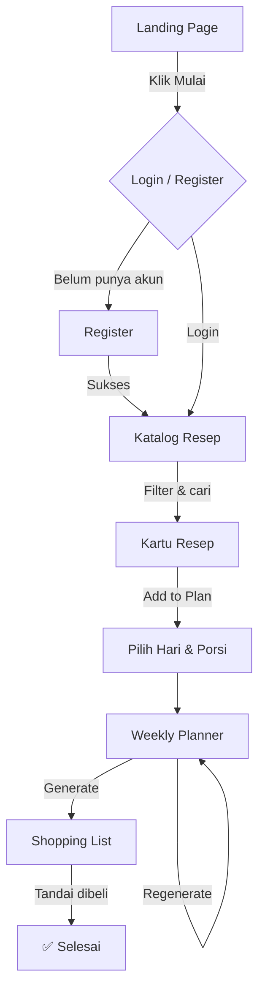

# 🍳 CookPlan — Rencana Masak Mingguan & Belanja Otomatis (PKM-K 2026)

> **CookPlan** adalah aplikasi web yang membantu pengguna merencanakan menu masakan mingguan, menghasilkan daftar belanja otomatis, dan menghubungkan mereka dengan produsen bahan makanan lokal.

---

## 📋 Daftar Isi

- [Tentang Projek](#tentang-projek)
- [Fitur Utama](#fitur-utama)
- [Status Fitur](#status-fitur)
- [Struktur Berkas](#struktur-berkas)
- [Tech Stack](#tech-stack)
- [Menjalankan Projek](#menjalankan-projek)
- [Alur Pengguna](#alur-pengguna)
- [Dokumentasi Lanjutan](#dokumentasi-lanjutan)
- [Roadmap](#roadmap)

---

## Tentang Projek

**CookPlan** adalah aplikasi berbasis web yang dirancang untuk menyederhanakan proses perencanaan masakan dan belanja bahan makanan bagi mahasiswa kos dan pekerja kantoran. Proyek ini dijalankan di bawah skema **PKM Kewirausahaan (PKM-K) 2026**.

> [!NOTE]
> **Status Kode Sekarang:** Projek ini dikembangkan menggunakan arsitektur modern **React (Vite) + Tailwind CSS v4 + Supabase**. Seluruh kode purwarupa (*prototype*) awal telah dibersihkan agar struktur repositori tetap profesional dan terorganisir.

---

## Fitur Utama

| # | Fitur | Status |
|---|-------|--------|
| 1 | 📚 Katalog Inspirasi Menu | 🔄 Planned |
| 2 | 📅 Perencanaan Menu Mingguan | 🔄 Planned |
| 3 | 🛒 Daftar Belanja Otomatis | 🔄 Planned |
| 4 | 🏪 Integrasi Produsen & Distributor Lokal | 🔄 Planned |
| 5 | 🚚 Pengiriman Bahan Masakan | 🔄 Planned |
| 6 | 🔔 Pengingat Ketahanan Bahan | 🔄 Planned |

> **Catatan:** Semua fitur saat ini berstatus **Planned (Direncanakan)** karena projek sedang dalam proses penulisan ulang kode dari awal (*code rebuild*). Berkas HTML lama (`Home page.html`, `deepsek.html`, dll.) digunakan sebagai acuan/referensi purwarupa saja. Lihat [`FEATURES.md`](./docs/FEATURES.md) untuk rincian spesifikasi.

---

## Struktur Berkas

```
CookPlan/
├── docs/                 # Dokumentasi proyek (PRD, Arsitektur, Fitur, Roadmap)
│   ├── ARCHITECTURE.md   # Dokumentasi arsitektur teknis sistem
│   ├── FEATURES.md       # Dokumentasi spesifikasi detail fitur
│   ├── PRD_PKM.md        # Product Requirement Document (PRD) PKM-K 2026
│   └── ROADMAP.md        # Rencana timeline pengembangan projek
├── public/
│   └── favicon.svg       # Aset favicon aplikasi
├── src/
│   ├── App.css           # Styling utama komponen
│   ├── App.jsx           # Komponen root & navigasi halaman utama
│   ├── index.css         # Entry point styling global (Tailwind CSS v4)
│   └── main.jsx          # Entry point rendering React ke DOM
├── .gitignore            # Konfigurasi pengabaian berkas Git
├── CONTRIBUTING.md       # Panduan kontribusi untuk kolaborasi tim
├── eslint.config.js      # Konfigurasi linter ESLint
├── index.html            # Berkas HTML utama/entry point Vite
├── package.json          # Manifest projek & daftar dependensi
├── package-lock.json     # Lockfile versi dependensi npm
├── README.md             # Dokumen panduan utama repositori
└── vite.config.js        # Konfigurasi build tool Vite
```

### Deskripsi Berkas Utama

#### `src/App.jsx`
Komponen utama React yang mengatur tampilan visual, state aplikasi (seperti daftar tab aktif), dan struktur layout keseluruhan (Header, Hero, Feature Grid, dan Footer).

#### `src/main.jsx` & `index.html`
Titik masuk utama aplikasi. `main.jsx` merender komponen React `App` ke dalam element DOM root yang didefinisikan di dalam `index.html`.

#### `src/index.css` & `src/App.css`
Konfigurasi styling global proyek menggunakan Tailwind CSS v4 serta modifikasi style tambahan untuk komponen antarmuka.

---

## Tech Stack

| Layer | Teknologi |
|-------|-----------|
| Frontend | React (Vite SPA) |
| Styling | Tailwind CSS v4.0 |
| Icons | Font Awesome v6.4.0 |
| Typography | Google Fonts — Poppins |
| Logic | React State Management |
| Backend & DB | Supabase (PostgreSQL) |
| Authentication | Supabase Auth (Email / OAuth) |

**Color Palette:**

| Kode Hex | Kegunaan | Deskripsi Warna |
|----------|----------|-----------------|
| `#2C3A1E` | Background / Teks Primer | Dark Olive Green |
| `#4E6B2F` | Warna Utama (Primary Brand) | Olive Green |
| `#7A8C4A` | Warna Sekunder / Aksen Ringan | Medium Sage |
| `#A6A96A` | Warna Aksen / Status / Border | Light Sage |
| `#D9DFB0` | Background Card / Teks Sekunder | Cream Green |

---

## Menjalankan Projek

Untuk menjalankan proyek CookPlan versi React + Vite ini di lingkungan lokal Anda, ikuti langkah-langkah berikut:

### Prasyarat
Pastikan Anda sudah menginstal **Node.js** (versi 18 atau lebih baru) dan **npm** di komputer Anda.

### Langkah-langkah Menjalankan Proyek:

1. **Clone repositori** ini ke komputer lokal Anda:
   ```bash
   git clone https://github.com/LeonardoTralala/CookPlan-Pimnas-2026.git
   cd CookPlan-Pimnas-2026
   ```
2. **Instal dependensi** yang dibutuhkan proyek:
   ```bash
   npm install
   ```
3. **Jalankan server pengembangan** lokal:
   ```bash
   npm run dev
   ```
4. Buka tautan lokal yang muncul di terminal (biasanya `http://localhost:5173`) menggunakan web browser Anda.

---

## Alur Pengguna



---

## Dokumentasi Lanjutan

| Dokumen | Deskripsi |
|---------|-----------|
| [`PRD_PKM.md`](./docs/PRD_PKM.md) | Dokumen Kebutuhan Produk (PRD) versi penyelarasan PKM-K 2026 |
| [`FEATURES.md`](./docs/FEATURES.md) | Spesifikasi lengkap setiap fitur (implementasi & rencana) |
| [`ROADMAP.md`](./docs/ROADMAP.md) | Prioritas pengembangan dari prototype ke production |
| [`ARCHITECTURE.md`](./docs/ARCHITECTURE.md) | Struktur kode, state management, dan panduan integrasi |

---

## Roadmap

Ringkasan singkat tahapan pengembangan selanjutnya:

1. **v1.0 — Production Ready**: Integrasi Supabase/Firebase untuk auth & storage nyata
2. **v1.1 — Recipe API**: Integrasi Spoonacular/Edamam untuk ribuan resep
3. **v1.2 — Local Supplier**: Dashboard mitra produsen & distributor lokal
4. **v1.3 — Delivery**: Layanan kurir bahan masakan ke rumah
5. **v2.0 — PWA**: Aplikasi mobile-installable dengan notifikasi ketahanan bahan

> Lihat [`ROADMAP.md`](./docs/ROADMAP.md) untuk detail lengkap.

---

*CookPlan © 2026 — Dibuat dengan ❤️ untuk para pejuang dapur kos dan kantoran.*
