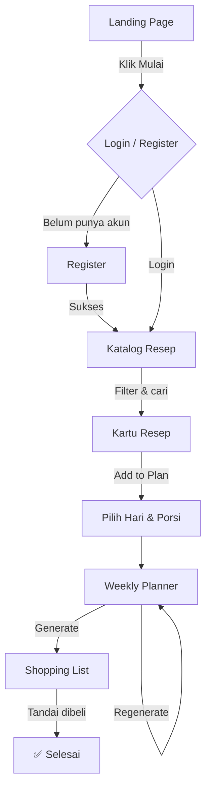

# 🍳 Masakin — Rencana Masak Mingguan & Belanja Otomatis

> **Cookplan** adalah aplikasi web yang membantu pengguna merencanakan menu masakan mingguan, menghasilkan daftar belanja otomatis, dan menghubungkan mereka dengan produsen bahan makanan lokal.

---

## 📋 Daftar Isi

- [Tentang Projek](#tentang-projek)
- [Fitur Utama](#fitur-utama)
- [Status Fitur](#status-fitur)
- [Struktur Berkas](#struktur-berkas)
- [Tech Stack](#tech-stack)
- [Menjalankan Projek](#menjalankan-projek)
- [Alur Pengguna](#alur-pengguna)
- [Dokumentasi Lanjutan](#dokumentasi-lanjutan)
- [Roadmap](#roadmap)

---

## Tentang Projek

**Masakin** (sebelumnya dikenal sebagai *Kukplen*) adalah aplikasi berbasis web statis (HTML/CSS/JS) yang dirancang untuk menyederhanakan proses perencanaan masakan dan belanja bahan makanan. Target utama pengguna adalah **mahasiswa kos** dan **pekerja kantoran** yang ingin memasak sendiri tanpa harus repot berpikir tiap hari.

Aplikasi ini dibangun sebagai purwarupa (*prototype*) fungsional menggunakan teknologi web murni tanpa framework JavaScript—cocok untuk dihandover ke tim yang akan mengintegrasikan backend nyata.

---

## Fitur Utama

| # | Fitur | Status |
|---|-------|--------|
| 1 | 📚 Katalog Inspirasi Menu | ✅ Implemented |
| 2 | 📅 Perencanaan Menu Mingguan | ✅ Implemented |
| 3 | 🛒 Daftar Belanja Otomatis | ✅ Implemented |
| 4 | 🏪 Integrasi Produsen & Distributor Lokal | 🔄 Planned |
| 5 | 🚚 Pengiriman Bahan Masakan | 🔄 Planned |
| 6 | 🔔 Pengingat Ketahanan Bahan | 🔄 Planned |

> Lihat [`FEATURES.md`](./FEATURES.md) untuk dokumentasi lengkap setiap fitur.

---

## Struktur Berkas

```
Cookplan/
├── Home page.html       # Landing Page utama (Masakin)
├── deepsek.html         # Aplikasi utama fungsional (Kukplen core)
├── Untitled-2.html      # UI Prototype / desain komponen
├── Untitled-1.html      # Draft awal (pure CSS + Spoonacular API plan)
├── README.md            # Dokumen ini
├── FEATURES.md          # Dokumentasi detail fitur
├── ROADMAP.md           # Rencana pengembangan
└── ARCHITECTURE.md      # Dokumentasi arsitektur teknis
```

### Deskripsi Berkas Utama

#### `Home page.html` — Landing Page
Halaman depan komersial berisi:
- Hero section dengan CTA
- Daftar fitur unggulan (3 kartu fitur)
- Cara Kerja (3 langkah: Pilih resep → Atur jadwal → Dapatkan daftar belanja)
- Testimoni pengguna
- FAQ interaktif (accordion)
- Footer dengan informasi kontak

#### `deepsek.html` — Aplikasi Utama
Aplikasi fungsional client-side berisi:
- Modul autentikasi (Login / Register)
- Katalog resep dengan pencarian & filter
- Weekly Planner (kalender mingguan Senin–Minggu)
- Auto Shopping List dengan kategorisasi dan kalkulasi biaya

---

## Tech Stack

| Layer | Teknologi |
|-------|-----------|
| Markup | HTML5 (Semantic) |
| Styling | Tailwind CSS (via CDN) |
| Icons | Font Awesome v6.4.0 |
| Typography | Google Fonts — Poppins |
| Logic | Vanilla JavaScript (ES6+) |
| Storage | In-memory state (no persistence) |
| API | Mock data (no external API calls yet) |

**Color Palette:**

| Variabel | Nilai | Digunakan di |
|----------|-------|--------------|
| `--primary` | `#4CAF50` (Green) | Landing Page |
| `--primary` | `#FF6B6B` (Coral) | App (deepsek.html) |
| `--secondary` | `#FF9800` (Orange) | Landing Page |
| `--secondary` | `#4ECDC4` (Teal) | App (deepsek.html) |

---

## Menjalankan Projek

Projek ini bersifat **statis penuh** — tidak ada proses build, instalasi Node.js, atau database yang diperlukan.

### Langkah-langkah

1. **Clone atau download** repositori ini ke komputer lokal.
2. Pastikan terhubung ke **internet** (dibutuhkan untuk memuat Tailwind CSS, Font Awesome, dan gambar dari Unsplash via CDN).
3. Buka berkas `Home page.html` di browser:
   - Klik ganda berkas, **atau**
   - Klik kanan → *Open with* → Google Chrome / Firefox / Edge
4. Dari Landing Page, klik **"Mulai Rencanakan Sekarang"** untuk masuk ke aplikasi, **atau** buka langsung `deepsek.html`.
5. Gunakan kredensial berikut untuk login cepat:

```
Username : user1
Password : password1
```

> Atau daftarkan akun baru melalui halaman Register.

---

## Alur Pengguna



---

## Dokumentasi Lanjutan

| Dokumen | Deskripsi |
|---------|-----------|
| [`FEATURES.md`](./FEATURES.md) | Spesifikasi lengkap setiap fitur (implementasi & rencana) |
| [`ROADMAP.md`](./ROADMAP.md) | Prioritas pengembangan dari prototype ke production |
| [`ARCHITECTURE.md`](./ARCHITECTURE.md) | Struktur kode, state management, dan panduan integrasi |

---

## Roadmap

Ringkasan singkat tahapan pengembangan selanjutnya:

1. **v1.0 — Production Ready**: Integrasi Supabase/Firebase untuk auth & storage nyata
2. **v1.1 — Recipe API**: Integrasi Spoonacular/Edamam untuk ribuan resep
3. **v1.2 — Local Supplier**: Dashboard mitra produsen & distributor lokal
4. **v1.3 — Delivery**: Layanan kurir bahan masakan ke rumah
5. **v2.0 — PWA**: Aplikasi mobile-installable dengan notifikasi ketahanan bahan

> Lihat [`ROADMAP.md`](./ROADMAP.md) untuk detail lengkap.

---

*Masakin © 2025 — Dibuat dengan ❤️ untuk para pejuang dapur kos dan kantoran.*
