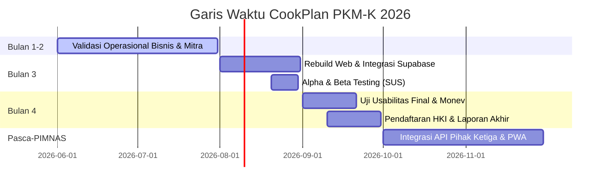

# 🗺️ ROADMAP.md — Rencana Pengembangan CookPlan (PKM-K 2026)

Dokumen ini mendefinisikan tahapan pengembangan CookPlan dari validasi bisnis awal hingga menjadi produk digital siap pakai untuk monev PKM-K dan rencana jangka panjang pasca-PIMNAS.

---

## Status Saat Ini: Rebuild dari Purwarupa (v0.0)

Aplikasi sedang dalam tahap penulisan ulang kode (*code rebuild*) dari purwarupa statis HTML lama ke arsitektur modern berbasis **React SPA + Tailwind CSS v4 + Supabase**.

---

## Garis Waktu Pengembangan PKM-K (4 Bulan)

---

## Fase Pengembangan Detail

### 🔄 Fase 1 — Bulan 1 & 2: Validasi Operasional Bisnis & Mitra (Pre-App)
> **Target:** Memvalidasi pasar, mendapatkan transaksi riil pertama secara manual, dan onboarding mitra lokal.

- [ ] **Onboarding Mitra Lokal:** Menjalin kerja sama dropship dengan pedagang sayur/kelontong lokal di dekat area uji coba.
- [ ] **Pemasaran & Pre-Order Manual:** Meluncurkan promosi ke mahasiswa kos dan menerima pesanan menu mingguan secara manual (Google Form & WhatsApp).
- [ ] **Distribusi Pengiriman:** Menguji alur pengantaran bahan masakan menggunakan kurir tim PKM-K untuk mengukur kepuasan pelanggan awal dan menghitung margin profit nyata.
- [ ] **Penyusunan Mockup UI/UX:** Mendesain visual aplikasi web menggunakan palet warna *sage green* berdasarkan masukan dari pengguna fase awal.

---

### 🔧 Fase 2 — Bulan 3: Pengembangan Sistem & Rebuild Web (MVP)
> **Target:** Menyelesaikan aplikasi web fungsional dengan database dinamis yang terintegrasi.

#### 2.1 Refactor & Setup Front-End
- [ ] Setup proyek React (Vite) dengan Tailwind CSS v4.0.
- [ ] Terapkan desain antarmuka responsif (Mobile-first).
- [ ] Konfigurasi skema warna global sesuai PRD:
  * Primer: `#4E6B2F` (Olive Green)
  * Sekunder: `#7A8C4A` (Medium Sage)
  * Background: `#2C3A1E` (Dark Olive) & `#D9DFB0` (Cream Green)

#### 2.2 Integrasi Database & Backend (Supabase)
- [ ] Integrasi Supabase Auth untuk registrasi & login user.
- [ ] Buat skema database Supabase:
  * Tabel `profiles` (profil pengguna)
  * Tabel `recipes` & `recipe_ingredients` (katalog resep)
  * Tabel `weekly_plans` & `meal_entries` (rencana masak mingguan)
  * Tabel `orders` & `order_items` (rekaman transaksi & ID pesanan unik)
  * Tabel `subscriptions` (paket langganan bulanan)
- [ ] Migrasi data 7 resep default ke Supabase.

#### 2.3 Checkout Hibrida & WhatsApp Redirect
- [ ] Hubungkan tombol Checkout dengan trigger penyimpanan baris baru ke tabel `orders` Supabase untuk memperoleh ID Pesanan unik (contoh: `#CP-260527-004`).
- [ ] Integrasikan generator pesan WhatsApp dinamis yang memformat daftar belanjaan + ID pesanan ke tautan WhatsApp Admin.
- [ ] Implementasikan visual demo pembayaran sandbox (Midtrans Sandbox) untuk menunjukkan sisi profesionalisme ke juri Monev.

#### 2.4 Uji Coba Pengguna (User Testing)
- [ ] **Alpha Testing:** Memastikan tidak ada bug sintaks (seperti bug pencarian bahan) dan alur penyimpanan database berjalan lancar.
- [ ] **Beta Testing:** Meminta 10–15 mahasiswa kos menggunakan aplikasi CookPlan selama 1 minggu.
- [ ] **Pengukuran SUS:** Membagikan kuesioner dan menghitung skor System Usability Scale (target >78).

---

### 🏆 Fase 3 — Bulan 4: Penilaian Monev, HKI, & Launching
> **Target:** Penilaian Monev PKM-K, perlindungan hukum produk, dan pelaporan akhir.

- [ ] **Pendaftaran HKI (Hak Cipta):** Mendaftarkan program aplikasi web CookPlan ke DJKI untuk perlindungan Hak Kekayaan Intelektual (luaran PKM wajib).
- [ ] **Analisis Finansial PKM-K:** Merangkum total omzet penjualan, margin laba bersih, dan laju pertumbuhan pengguna dari database.
- [ ] **Penyusunan Laporan Akhir:** Memasukkan hasil uji coba, SUS score, dan performa keuangan ke dalam Laporan Akhir PKM-K.
- [ ] **Persiapan Presentasi PIMNAS:** Membuat slide presentasi dan video promosi aplikasi CookPlan dengan visualisasi data transaksi yang meyakinkan.

---

### 🚀 Fase Pasca-PIMNAS — Skalabilitas & Ekspansi (v1.5 - v2.0)
> **Target:** Menjadikan CookPlan sebagai bisnis startup yang berkelanjutan dan fully automated.

- [ ] **Integrasi API Logistik Nyata:** Menghubungkan platform dengan API pihak ketiga seperti BiteShip atau GoSend untuk otomatisasi pengantaran.
- [ ] **API Resep Eksternal:** Menghubungkan ke API resep global (Edamam atau Spoonacular) untuk memperluas pustaka resep.
- [ ] **PWA (Progressive Web App):** Membuat aplikasi dapat diinstal di Android/iOS dan mendukung notifikasi pengingat ketahanan bahan makanan secara luring (*offline notification*).
- [ ] **Pembayaran Otomatis Riil:** Mengaktifkan API Midtrans/Xendit Production untuk memproses pembayaran non-tunai langsung di web tanpa WhatsApp redirect.

---

## Skala Prioritas Fitur (Prioritization Matrix)

| Fitur | Impact | Effort | Prioritas |
|-------|--------|--------|-----------|
| Fix Bug Pencarian Bahan | High | Low | 🔴 Segera (Bulan 3) |
| Supabase Auth & DB | High | Medium | 🔴 Segera (Bulan 3) |
| WhatsApp ID Redirect | High | Low | 🔴 Segera (Bulan 3) |
| Simulasi Checkout & Payment | High | Medium | 🔴 Segera (Bulan 3) |
| Uji Coba SUS & Validasi | High | Medium | 🔴 Segera (Bulan 3-4) |
| Langganan Bulanan (Subscription) | Medium | Medium | 🟠 Sedang (Bulan 4) |
| Live Payment Gateway | Medium | High | 🟡 Nanti (Pasca-PIMNAS) |
| Live Logistics API (BiteShip) | Medium | High | 🟡 Nanti (Pasca-PIMNAS) |
| Notifikasi PWA & Smart Pantry | Medium | High | 🟡 Nanti (Pasca-PIMNAS) |

---

*Roadmap ini bersifat dinamis dan dievaluasi setiap minggu bersama seluruh anggota tim CookPlan.*
